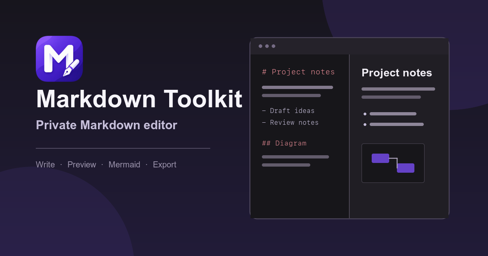
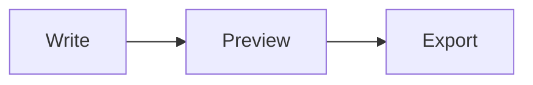

# Markdown Toolkit

**A private, local-first Markdown editor for writing, formatting, previewing, and exporting Markdown in the browser.**

[Open Markdown Toolkit](https://markdown-toolkit.pages.dev/) · [Report a bug](https://github.com/mpMohAn/markdown-toolkit/issues/new?template=bug-report.yml) · [Request a feature](https://github.com/mpMohAn/markdown-toolkit/issues/new?template=feature-request.yml)



## Why Markdown Toolkit?

Markdown Toolkit keeps the editing workflow compact and tool-focused. Documents are stored locally in the browser, previews are sanitized, and the core editor works without an account, backend, or AI service.

## Features

- CodeMirror editor with Markdown-aware syntax highlighting
- Live, sanitized GitHub Flavored Markdown preview
- Mermaid diagram rendering for `mermaid` fenced code blocks
- Browser-only IndexedDB persistence with autosave
- Deterministic local Markdown formatting with one-step undo
- Smart Markdown continuation and optional ghost-text autocomplete
- Formatting toolbar and keyboard shortcuts
- Resizable editor and preview panes
- Light and dark themes with persisted preferences
- Optional line numbers
- Copy exact Markdown or sanitized HTML
- Download Markdown or a standalone HTML document
- Optional local AI writing actions with review-before-apply

## Local AI writing

AI writing is an optional enhancement for supported Chrome desktop environments. It uses Chrome's built-in `LanguageModel` capability and does not send Markdown to an application backend or hosted AI provider.

- Explicitly enable AI before model preparation begins.
- Choose **Improve writing**, **Structure notes**, or **Summarize**.
- Continue editing while generation runs in the background.
- Review the complete suggestion before explicitly applying it.
- If the document changes during generation, the result is marked outdated and cannot overwrite the newer content.

The editor remains fully usable when the API or local model is unavailable. Other browsers do not currently receive an AI fallback.

## Mermaid diagrams

Use a fenced `mermaid` block to render a diagram in the preview while keeping the Markdown source unchanged:

````markdown

````

Mermaid is loaded only when a document contains a Mermaid block. Invalid diagrams display a contained error without replacing the source.

## Privacy and security

- Documents and filenames are stored locally in the browser.
- No account, document backend, or cloud sync is used.
- Preview, copied HTML, downloaded HTML, and Mermaid SVG output cross application-owned sanitization boundaries.
- AI document content is processed through Chrome's optional built-in local AI capability, not an application inference service.
- Cloudflare may collect deployment-level traffic and performance analytics; Markdown content, filenames, AI prompts, AI results, and editor keystrokes are outside the application's intended analytics scope.
- Remote images in a Markdown document may contact their hosts when rendered, and external links follow the destination site's privacy practices.

Avoid including private document content in public GitHub issues. To report a security vulnerability privately, use [GitHub Security Advisories](https://github.com/mpMohAn/markdown-toolkit/security/advisories/new).

## Browser support

Current Chrome, Safari, and Firefox desktop are the main editor targets. Chrome's built-in AI is capability-detected separately and is not required for the editor.

Known limitation: autocomplete ghost text can appear slightly vertically misaligned in Firefox. The suggestion remains functional, and browser-specific pixel offsets are intentionally avoided while the CodeMirror-native cause is investigated.

## Development

Requirements: a current Node.js release and npm.

```sh
git clone https://github.com/mpMohAn/markdown-toolkit.git
cd markdown-toolkit
npm install
npm run dev
```

Run the complete local validation suite:

```sh
npm run lint
npm run format:check
npm test
npm run build
```

### Tech stack

- React and TypeScript
- Vite
- CodeMirror
- unified, remark, and rehype
- Mermaid
- IndexedDB
- Vitest and Testing Library

## Support and feedback

- [Report a reproducible bug](https://github.com/mpMohAn/markdown-toolkit/issues/new?template=bug-report.yml)
- [Propose a focused improvement](https://github.com/mpMohAn/markdown-toolkit/issues/new?template=feature-request.yml)
- [Support the project through GitHub Sponsors](https://github.com/sponsors/mpMohAn)

## Roadmap

The released V1 is intentionally local-first and browser-only. Current deferred work includes:

- Investigating Firefox autocomplete ghost-text alignment with measured CodeMirror geometry
- Evaluating a cross-browser local-AI fallback without coupling the core editor to hosted inference
- Reviewing the accepted Mermaid 12 supply-chain findings when a compatible patched release becomes available
- Using real product feedback to prioritize future Markdown tools rather than expanding the editor without evidence

## License

The source code is available under the [MIT License](LICENSE). You may use, modify, distribute, and commercially use it while retaining the copyright and license notice.

The license does not grant permission to use the Markdown Toolkit name or logo in a way that suggests endorsement by or affiliation with the original project.
